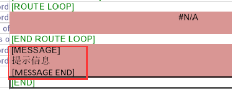

###Nesting优化信息提醒
**需求背景**
>客户雕刻机有两个轴，装有两把刀T101 T102，直径都为6mm
T101刀刃短，用来开18厚的板
T102刀刃长，用来开25以上的板件
现在客户要做前铜条产品，需要用到4MM刀开槽；
设备限制，所以对于做铜条槽的刀只能通过人工换刀实现。为了方便操作师傅了解相关信息
需要实现的是：
当18的板件用到B4刀的时候，需要提醒师傅，将T102换成4mm的刀
当25以上板件用到B4刀的时候，需要提醒师傅，将T101换成4mm的刀
[Worktile项目链接](https://dmsoft.worktile.com/mission/projects/5e377e8ae727c16b0f47a3cf/tasks/5ece2c9526a2063b6e895f43)

**需求实现**
- 刀具文件增加提示信息识别
    ```
    提示信息头部：[MESSAGE]
    尾部：[MESSAGE END]
    ```
    

- NestPrinter增加WarningMessage字段
- 排布图界面增加信息提示内容

    

**涉及模块**
1. Nesting优化
2. 刀具文件
3. NestPrinter贴标程序

**数据流**


